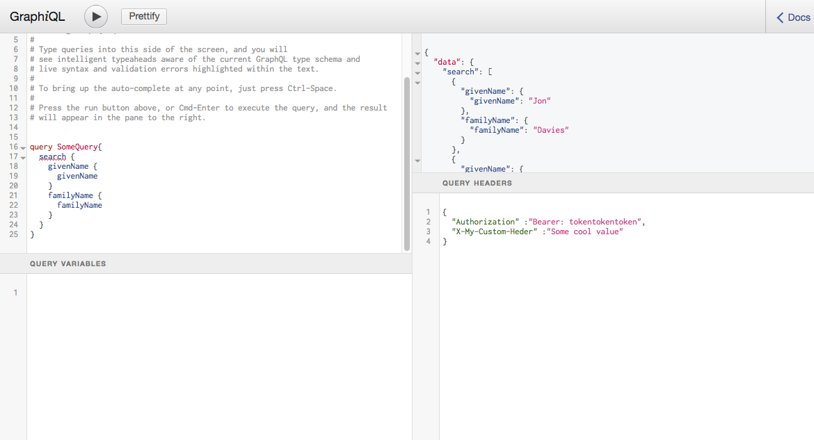

GraphiQL
========

*/ˈɡrafək(ə)l/* A graphical interactive in-browser GraphQL IDE. [Try the live demo](http://graphql.org/swapi-graphql).

### Getting started

This is a simple fork of the original [GraphiQL](https://github.com/graphql/graphiql) project. The only difference -at the time of the fork- is the ability to add http and custom headers for graphql request.

These headers are appended to every query that runs through this interface, including introspection queries. Also the introspection query is repeated and graphql schema is refreshed when headers field on the UI is modified.